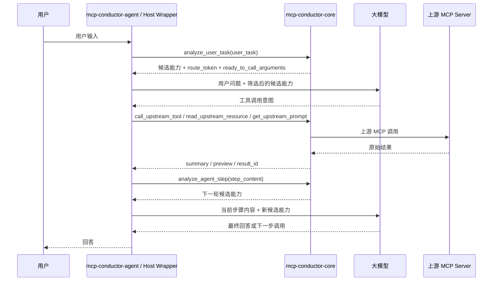

# Host Orchestrator 与每轮步骤路由

## 文档目的

这份文档专门回答一个核心问题：

```text
能不能让用户问题和每一次 agent loop 步骤都先交给 mcp-conductor，
由 mcp-conductor 筛选当前需要的上游工具和资源，
再让大模型在筛选后的范围内继续处理？
```

结论是：可以作为产品目标实现，但不能只靠当前 MCP Server 形态完成。当前 `mcp-conductor` 可以继续作为 Gateway Core；如果要强制每轮触发，需要在它外面新增 Host wrapper、Agent Orchestrator 或 IDE/plugin 层。

## 当前形态

当前项目是：

```text
mcp-conductor-core
  对外：MCP Server
  对内：MCP Client Manager + Capability Router + Execution Gateway
```

Codex、Claude Code、Cursor 这类工具是 Host。Host 会为 `mcp-conductor` 创建一个 MCP Client，并读取它暴露的公开 tools。

当前 Host 能看到的是：

```text
analyze_user_task
list_upstream_capabilities
list_exposed_capabilities
recommend_capabilities
call_upstream_tool
read_upstream_resource
read_upstream_resource_template
get_upstream_prompt
read_result
```

Host 看不到 `mcp-conductor` 内部配置的全部上游 tools/resources/resource templates/prompts。只有当 Host/模型主动调用 `analyze_user_task` 或 `recommend_capabilities` 后，`mcp-conductor` 才会根据当前输入返回候选能力和 route-token-gated 调用参数。

## 不能强制触发的原因

普通 MCP Server 没有这些权限：

- 拦截用户输入。
- 决定 Host 每轮给模型暴露哪些真实工具。
- 插入 Host 内部 agent loop。
- 在每次工具结果回填前强制执行自己的逻辑。
- 动态改写外部 Host 已经注册的工具列表。

因此，当前 Gateway Server 只能做到：

```text
被调用时，完成分析、推荐、校验、执行和结果整理。
```

不能做到：

```text
不被调用时，主动知道用户问题并强制筛选工具。
```

## 用户目标的正确架构

如果目标是“第一次用户输入”和“后续每一次 loop 步骤”都先筛选能力，推荐架构是：



在这个架构里：

- `mcp-conductor-core` 继续做 Gateway，不直接管理完整对话。
- `mcp-conductor-agent` 控制 agent loop，负责每轮调用 core。
- 模型仍然负责理解任务、选择候选能力、填写参数和生成回答。
- 上游工具执行仍然必须经过 core 的推荐凭证、风险策略和结果管理。

## Step routing 的输入原则

用户已经明确希望：

```text
第一次只把用户问题给 mcp-conductor。
后面每次只把当前 loop 步骤内容给 mcp-conductor。
不要把所有历史内容每次都合在一起传入。
```

因此后续 `analyze_agent_step` 应该接收“当前步骤内容”，而不是完整对话。为了避免丢失必要上下文，可以额外传入很短的 session metadata，但不能把全部历史塞回去。

推荐输入：

```json
{
  "session_id": "task_123",
  "step_index": 2,
  "step_type": "tool_result",
  "step_content": "读取配置文件失败，路径不存在。",
  "limit": 8
}
```

推荐输出：

```json
{
  "status": "ok",
  "routing_round_id": "round_456",
  "selected_capabilities": [],
  "next_step_hint": "Retry with a filesystem capability if one is configured and the path is inside allowed_roots."
}
```

## 为什么还需要 session

虽然每次路由只传当前步骤内容，但 Gateway 仍然需要轻量 session 状态：

- 记录最初用户任务摘要。
- 记录最近几次推荐过哪些能力。
- 记录哪些能力已经调用成功或失败。
- 避免在同一轮里重复推荐明显失败的能力。
- 绑定 `recommendation_id`、`route_token`、`result_id` 和 `pending_action_id` 的生命周期。

这个 session 不等于完整对话记忆。它只服务于路由、安全和调试。

## 下一步 Gateway Core 可以先做什么

即使暂时不开发完整 Host wrapper，当前 MCP Server 也可以先补齐这些能力：

1. `RoutingSessionStore`
   - 保存 `session_id`、原始任务摘要、最近步骤摘要、推荐过的能力、调用过的能力和失败记录。
   - 设置 TTL 和最大条数，避免无限增长。

2. `start_routing_session`
   - 用户任务开始时创建路由会话。
   - 返回 `session_id` 和第一轮推荐。

3. `analyze_agent_step`
   - 接收单次 `step_content`。
   - 使用当前步骤文本、轻量 session 状态和能力注册表重新筛选能力。
   - 返回本轮候选能力、`routing_round_id`、`next_public_tool` 和 `ready_to_call_arguments`。

4. `list_routing_session_state`
   - 仅用于调试和 Inspector 查看。
   - 不返回敏感 payload。

5. `end_routing_session`
   - 主动释放路由会话和相关临时状态。

6. `scripts/agent_loop_demo.py`
   - 本地模拟 Host/Agent Orchestrator。
   - 演示“用户输入 -> step routing -> 模型选择占位 -> route-gated 调用 -> 工具结果 -> 下一轮 step routing”。

## 下一步 Host/Agent Orchestrator 要做什么

真正强制每轮筛选时，需要新增外层运行时：

```text
mcp-conductor-agent
  -> 接收用户输入
  -> 调用 mcp-conductor-core 的 step routing API
  -> 构造本轮模型上下文
  -> 暴露筛选后的工具候选
  -> 接收模型工具调用
  -> 通过 core 执行上游能力
  -> 将工具结果作为下一轮 step_content
  -> 循环直到完成
```

这可以有几种实现形态：

- 独立 CLI agent。
- Codex/Claude Code 外层 wrapper。
- IDE 插件。
- 自己实现的 MCP Host。

它们共同点是：必须由这个外层运行时控制 loop，而不是等待普通 MCP Server 自己触发。

## 与 proxy/hybrid 的关系

`proxy/hybrid` 动态工具注册可以改善 Host 直接看到工具的问题，但它仍然不能自动控制每轮 loop。

区别如下：

| 方案 | 能解决什么 | 不能解决什么 |
| --- | --- | --- |
| router | 压缩上游能力，通过 `analyze_user_task` 推荐候选能力 | 不能强制 Host 每轮调用 |
| proxy/hybrid | 让部分安全上游 tool 未来可直接出现在 Host 工具列表 | 不能强制每轮先路由，也不适合暴露大量工具 |
| Host/Agent Orchestrator | 可以强制每次用户输入和每次 loop 步骤先筛选 | 需要开发 Host/wrapper/plugin，不只是 MCP Server |

## 当前结论

当前项目不应该把自己描述成“已经能强制每轮筛选工具”。更准确的状态是：

```text
当前已经完成 Gateway Core 的主要能力：
配置上游、发现能力、推荐能力、route token 校验、受控执行和结果管理。

下一步应先在 Gateway Core 中补齐 step routing API 和 routing session。

如果最终目标是强制每轮触发，
再开发 mcp-conductor-agent 作为 Host wrapper / Agent Orchestrator。
```
