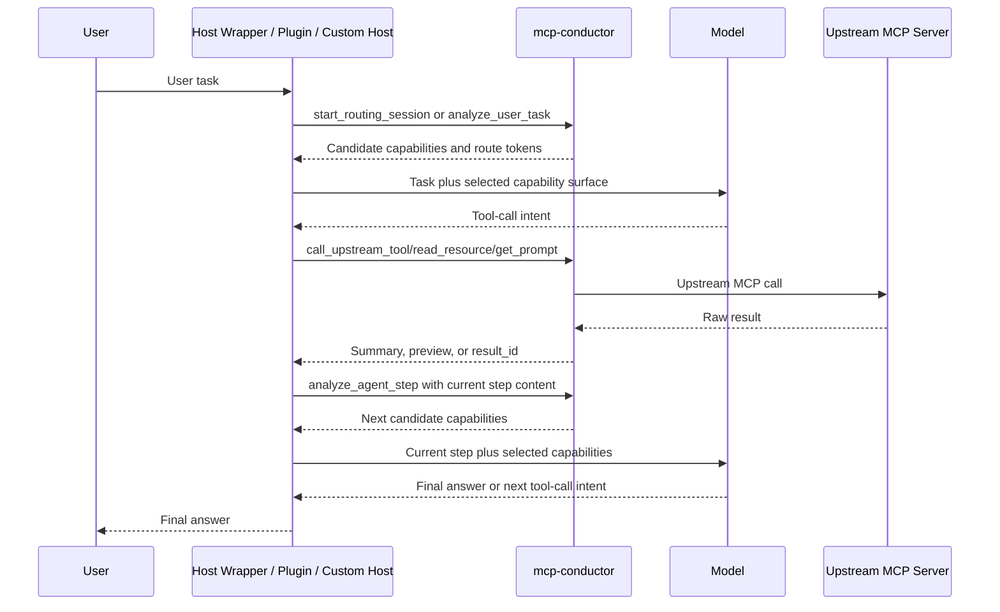

# Host Orchestrator And Step Routing

## Core Question

The desired product behavior is:

```text
For the first user message, route the task through mcp-conductor.
For later loop steps, route only the current step content through mcp-conductor.
Then let the model work with a smaller selected capability set.
```

The current MCP Gateway Server can provide the routing API, but it cannot force
an external host to call that API on every turn.

## Current Shape

`mcp-conductor` is currently:

```text
MCP Gateway Server
  -> upstream MCP client manager
  -> capability discovery
  -> capability recommendation
  -> route-token-gated execution
```

External tools such as Codex, Claude Code, Cursor, or other MCP hosts create an
MCP client for this server and see only the public tools exposed by
`mcp-conductor`.

Current public routing tools:

```text
analyze_user_task
start_routing_session
analyze_agent_step
list_routing_session_state
end_routing_session
recommend_capabilities
```

Current access tools:

```text
call_upstream_tool
read_upstream_resource
read_upstream_resource_template
get_upstream_prompt
read_result
```

The host cannot see every upstream tool/resource/template/prompt directly in
router mode. It must call the routing tools first to receive candidate
capabilities and `ready_to_call_arguments`.

## Why The Server Cannot Force Triggering

A normal MCP server cannot:

- Intercept the user's message before the host/model sees it.
- Decide which tools the host exposes to the model.
- Insert itself into the host's internal agent loop.
- Force itself to run after every tool result.
- Rewrite the host's registered tool list at runtime.

So the gateway can only route when it is called.

## Correct Architecture For Forced Per-Step Routing

Hard per-step routing requires an outer runtime:



In this architecture:

- The gateway continues to manage upstream MCP capabilities.
- The outer host/wrapper controls the agent loop.
- The model still chooses among the selected candidates and fills arguments.
- All upstream access still goes through route-token validation and risk policy.

## Current Implemented Pieces

The repository currently implements the Gateway Core pieces needed by a future
outer runtime:

- `RoutingSessionStore`.
- `start_routing_session`.
- `analyze_agent_step`.
- `list_routing_session_state`.
- `end_routing_session`.
- Session-aware recommendation reranking.
- Route-token-gated public access tools.

The repository intentionally does not include:

- A standalone agent CLI.
- A model provider adapter.
- A provider-specific model loop.
- A complete MCP Host implementation.

Those pieces should live outside the gateway package if they become necessary.

## Relationship To Proxy/Hybrid Exposure

`proxy` and `hybrid` exposure modes can eventually reduce the number of manual
routing calls by exposing selected safe upstream tools more directly. They still
do not solve forced per-step routing.

| Mode | Solves | Does Not Solve |
| --- | --- | --- |
| router | Keeps upstream capabilities compressed behind routing tools | Cannot force host calls |
| proxy/hybrid | Can expose selected safe upstream tools directly in the future | Cannot control every loop step |
| host wrapper/plugin | Can force per-step routing | Requires host-side implementation |

## Current Conclusion

The project should be described as:

```text
mcp-conductor is a Gateway Server with step-routing support.
It is not a full Host or agent runtime.
Forced per-step routing requires host-side instructions, hooks, wrappers,
plugins, or a separate custom Host.
```
