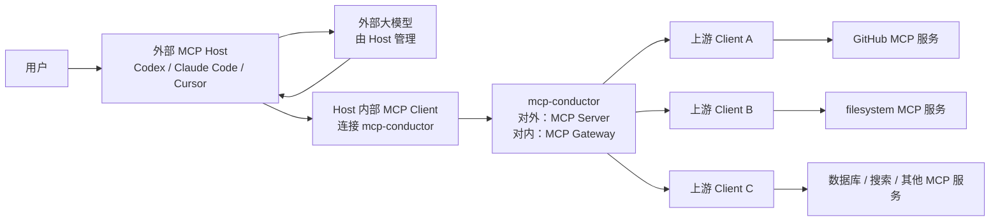
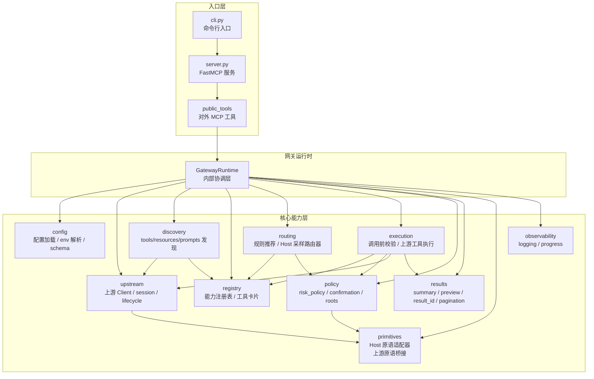
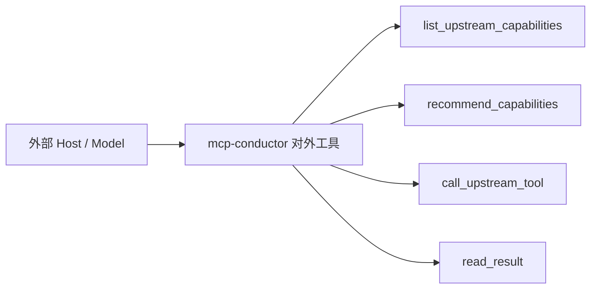
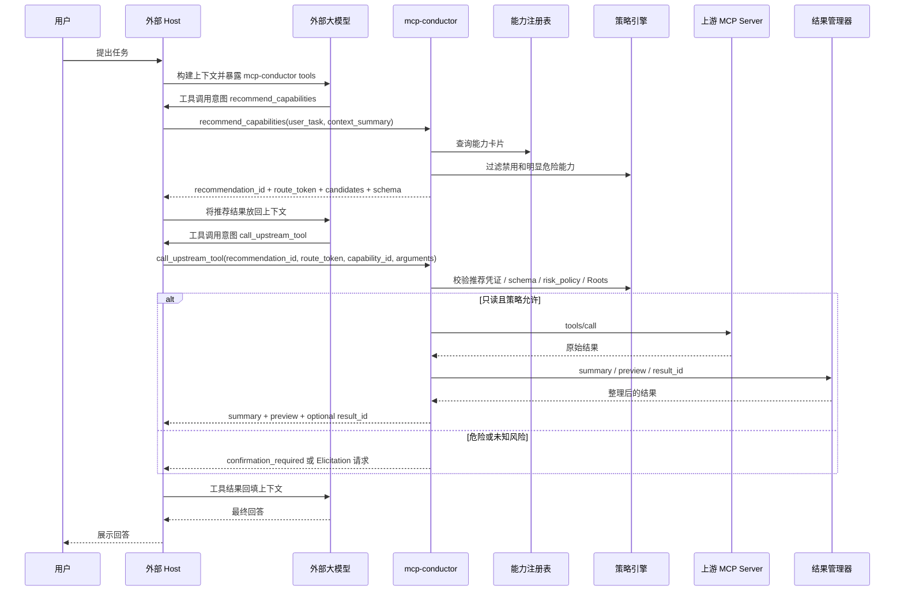
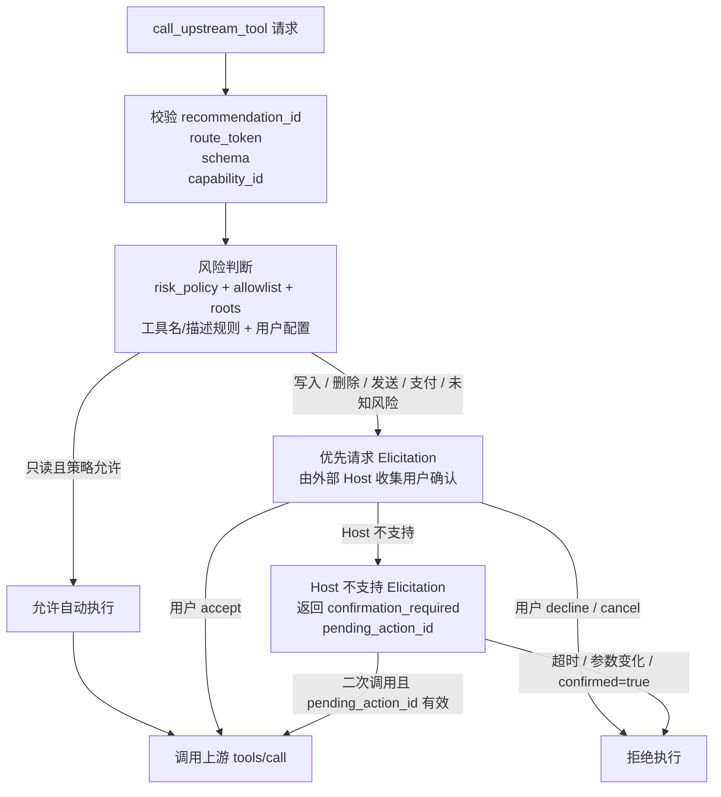
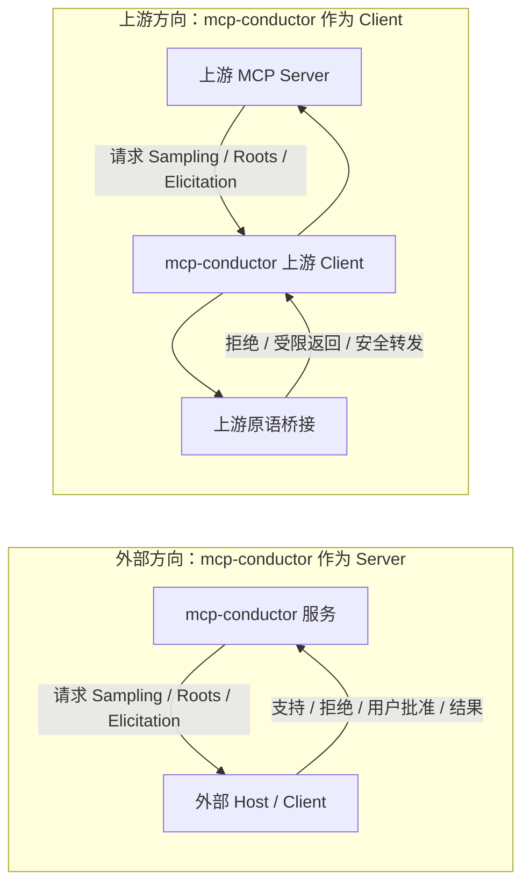
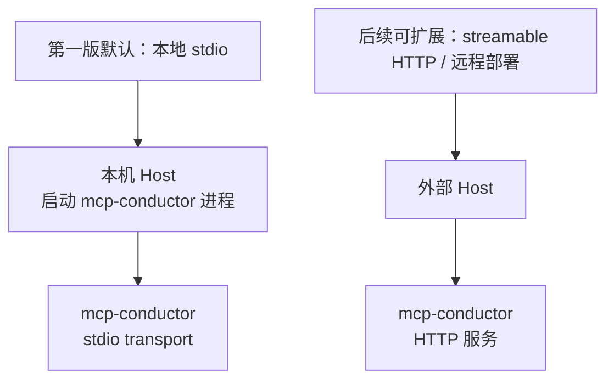

# 最终目标架构图

这份文档记录 `mcp-conductor` 最终要实现的 MCP Gateway Server 架构图。

核心定位保持不变：

```text
对外：标准 MCP Server
对内：上游 Client 管理器 + 能力路由 + 网关执行 + 结果管理
```

## 总体拓扑



要点：

- 外部 Host 只把 `mcp-conductor` 当作一个普通 MCP Server。
- 外部大模型只看到 `mcp-conductor` 暴露的少量高级 tools。
- `mcp-conductor` 内部为每个上游 MCP Server 维护独立 Client/session。
- 上游 MCP Server 的大量底层 tools/resources/resource templates/prompts 不直接暴露给外部大模型。

## 内部模块架构



边界规则：

- `server.py` 只负责创建 FastMCP 服务和注册对外工具。
- `public_tools` 只调用 `GatewayRuntime`，不直接访问上游 Client。
- `routing` 只负责推荐能力，不执行工具。
- `execution` 必须经过推荐凭证、schema、risk policy、Roots/allowlist 校验后才能调用上游工具。
- `policy` 不依赖 FastMCP。
- `results` 不调用上游工具。
- `primitives` 只处理协议协作能力，不负责业务路由。

## 对外工具

第一版对外暴露的 MCP tools：



各工具职责：

- `list_upstream_capabilities`：分页列出能力摘要，不返回完整内部状态。
- `recommend_capabilities`：根据用户任务返回候选能力、schema、`recommendation_id` 和 `route_token`。
- `call_upstream_tool`：只调用已推荐、已校验、风险策略允许的上游 tool。
- `read_result`：读取当前 session 可访问的缓存结果。

## 推荐与执行链路



## 危险操作确认链路



关键约束：

- `read_only_hint` 只能作为提示，不能单独作为自动执行依据。
- 未知风险能力默认按危险处理。
- `pending_action_id` 必须不透明、不可猜测、有过期时间。
- 二次确认时参数不能变化。
- 不能用普通 `confirmed=true` 替代 `pending_action_id`。

## 客户端原语双向边界



第一版策略：

- 外部方向可以请求 Sampling、Roots、Elicitation，但是否支持和批准由外部 Host 决定。
- 上游方向不能无条件透传上游 Server 的请求。
- 上游 Sampling 默认拒绝或返回 unsupported。
- 上游 Roots 只能返回 Host Roots 与内部 allowlist 的受限交集。
- 上游 Elicitation 不允许索要 token、密码、密钥。

## 运行形态



当前第一版优先本地 `stdio`：

- 适合 Codex、Claude Code、Cursor 等本地开发工具。
- Host 启动 `mcp-conductor` 进程。
- Host 通过标准输入/输出与 MCP Server 通信。

后续如果支持远程部署，需要补充：

- HTTP 传输配置。
- 鉴权和访问控制。
- 多用户/session 隔离。
- 远程上游凭证管理。
- 部署文档和安全策略。

## 最终结构总结

```text
外部 Host
  -> mcp-conductor 对外工具
    -> 网关运行时
      -> 配置
      -> 上游客户端
      -> 能力发现
      -> 能力注册
      -> 能力路由
      -> 调用执行
      -> 策略控制
      -> 结果管理
      -> 原语桥接
        -> 上游 MCP Server
```

`mcp-conductor` 最终不是一个完整 Host，而是一个受外部 Host 调用的 MCP Gateway Server。它的核心价值是把大量上游 MCP Server 的能力收拢到一个受控入口里，减少外部模型直接看到的工具数量，并在执行前增加路由、安全、确认和结果管理边界。
